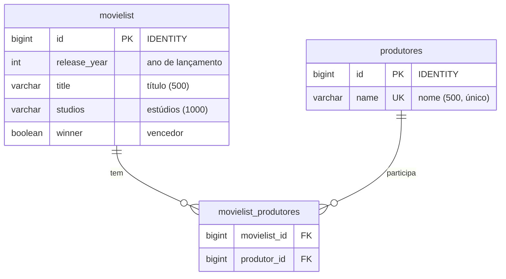

# Golden Raspberry Awards

Aplicação Spring Boot que carrega a lista de filmes do arquivo `Movielist.csv` em um banco H2 e expõe uma API REST para consultar intervalos de premiação dos produtores.

## Requisitos

- **JDK 21** 
- **Maven 3.9+**

## Como rodar o projeto

1. Na raiz do projeto, execute:

```bash
mvn spring-boot:run
```

2. A aplicação sobe em **http://localhost:8080**.

3. Ao iniciar, o banco é limpo e o CSV é carregado automaticamente (`Movielist.csv` em `src/main/resources`).

4. **Console H2** (opcional): http://localhost:8080/h2-console  
   - JDBC URL: `jdbc:h2:mem:movielistdb`  
   - User: `sa`  
   - Password: (vazio)

## Modelo ER

As tabelas do banco (H2) e o relacionamento entre elas:



- **movielist**: um registro por filme da lista (ano, título, estúdios, se venceu).
- **produtores**: um registro por produtor (nome único).
- **movielist_produtores**: tabela de junção N:N — um filme pode ter vários produtores e um produtor pode ter vários filmes.

## API REST

### GET /api/producers/intervals

Retorna o produtor com **maior** intervalo entre dois prêmios consecutivos e o que obteve dois prêmios **mais rápido** (menor intervalo).

**Exemplo de resposta:**

```json
{
  "min": [
    {
      "producer": "Producer 1",
      "interval": 1,
      "previousWin": 2008,
      "followingWin": 2009
    }
  ],
  "max": [
    {
      "producer": "Producer 1",
      "interval": 99,
      "previousWin": 1900,
      "followingWin": 1999
    }
  ]
}
```

- **min**: produtores com menor intervalo entre duas vitórias consecutivas (prêmios mais rápidos).
- **max**: produtores com maior intervalo entre duas vitórias consecutivas.

## Testes de integração

Os testes de integração garantem que a API retorna dados de acordo com o CSV carregado. Eles usam o perfil `test`, que carrega o arquivo `Movielist-test.csv` (dados controlados) e validam o formato e os valores de `min` e `max`.

Para executar **todos os testes** (incluindo os de integração):

```bash
mvn test
```

Para executar **apenas os testes de integração** da API de intervalos:

```bash
mvn test -Dtest=ProducerIntervalControllerIntegrationTest
```


